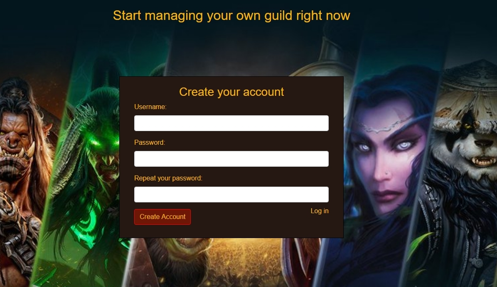
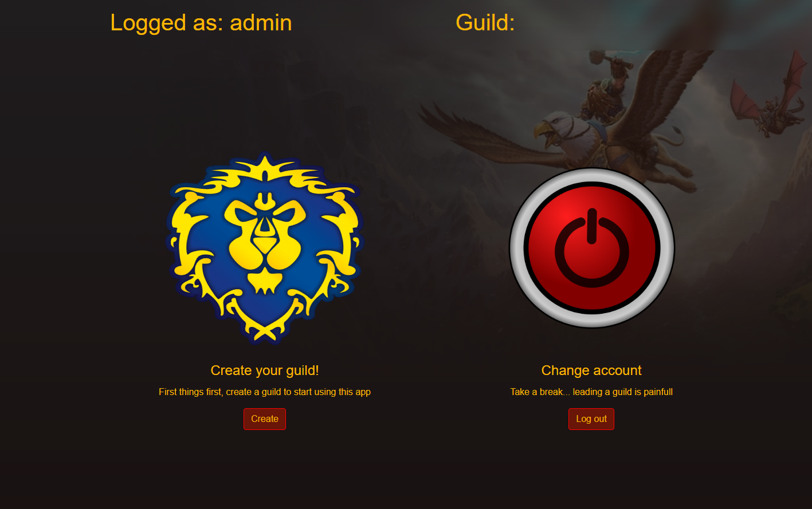
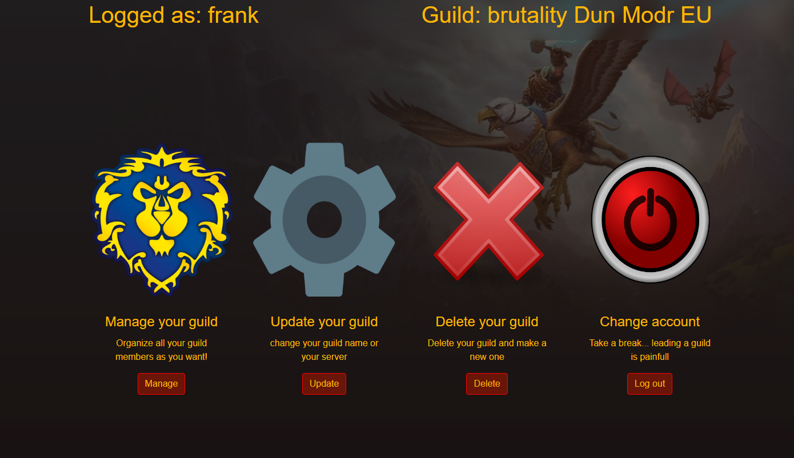
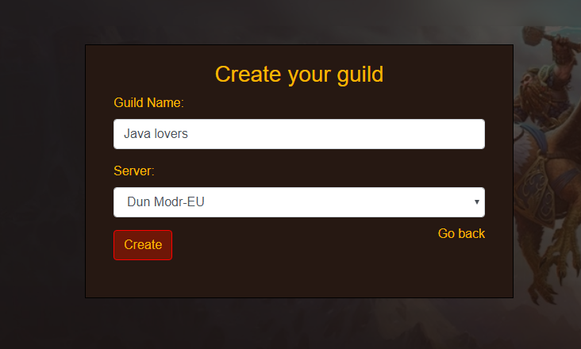
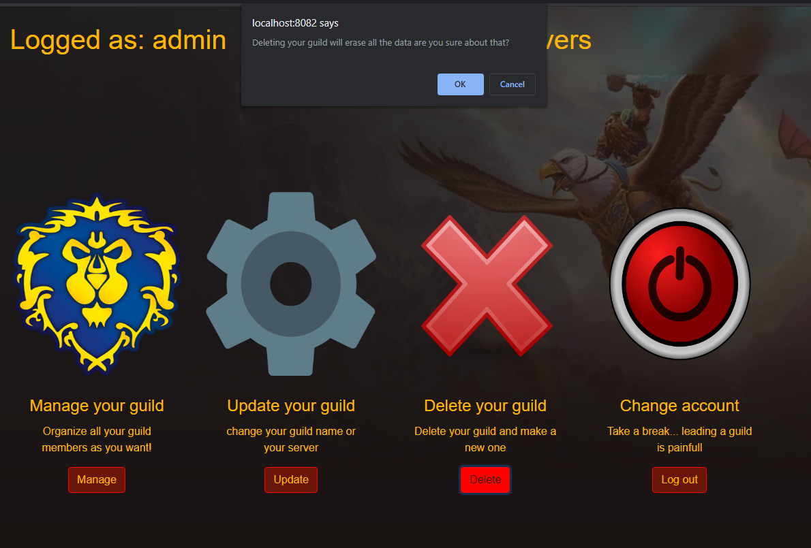

# WOW GUILD MANAGER

<h4>Aplicación para la asignatura de programación la cual consistira en un programa de gestion de tu guild (Grupo de jugadores organizados por rangos los cuales se juntan para cumplir objetivos dentro del juego)
para el juego world of warcraft</h4>

## Base de datos

La base de datos consta de 4 tablas:

**user**: Esta tabla contiene los datos de los usuarios los cuales usaremos para el login. Solo se requiere de nombre y contraseña.

**guild**: Esta tabla contiene la informacion de la guild del usuario (un usuario solo puede tener una guild)
tambien tiene la FK del servidor al que pertenece.

**server**: Simple información sobre el servidor al que pertenece esa guild.

**player**: Aqui es donde guardaremos mas informacion ya que es donde vamos a realizar las acciones de crud.
Esta tabla contiene la información de todos los miembros que pertenecen a una guild.
La aplicacion nos permitira dar de alta, modificar y borrar jugadores de nuestra guild.

## Login

Para acceder a la aplicación necesitaremos estas registrados. Si intentamos acceder al index sin estar logeados nos mandara a la pagina de login.

Para la creación de una cuenta la aplicación tendra en cuenta que los dos campos de contraseña sean iguales y en el caso de que esto ocurra buscara si existe ya un usuario con ese nombre.

## index
El index va a variar según el usuario que logea. En el caso de que no tenga ninguna guild solo tendra la opción de crear una y de hacer log out.
### index si el usuario no tiene guild:

En el caso de logear con una cuenta la que ya tenga una guild le dara las opciones de administrar su guild, actualizarla, borrarla o hacer log out.
### index si el usuario tiene guild

## Crear una guild

En el caso de que el usuario no tenga guild podra crear una en la siguiente ventana. Esta ventana tiene un filter que hace que no puedas acceder si no estas logeado o si ya tienes guild, de esta manera no podras crear mas de una guild por usuario.

La lista de servidores se alimenta de los servidores que tenemos en la base de datos.

## Borrar una guild

Cuando pulsemos el boton de borrar una guild saldra una ventana modal de javascript la cual nos dira si estamos seguros ya que perderemos todos los datos de esa guild

